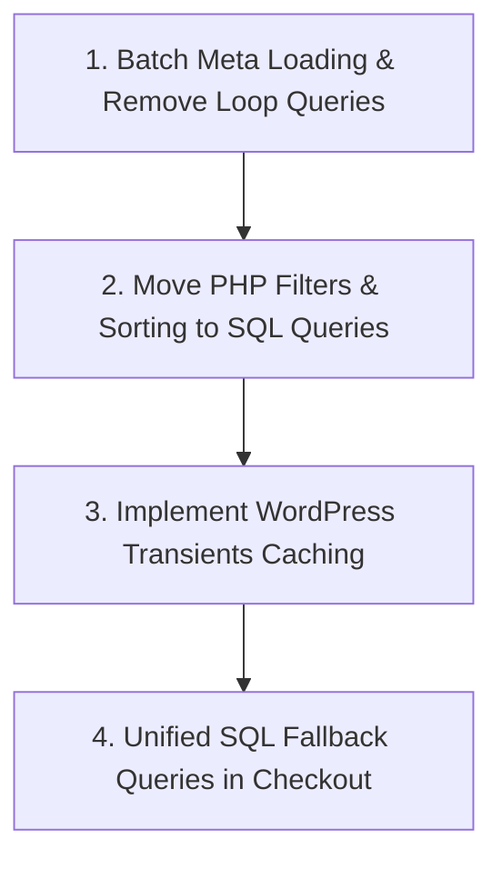

# Database Query Optimization Audit & Strategy

Yeh document `cosy-appointments` plugin mein database queries ki current performance, bottlenecks, aur unko resolve karne ke action plan ke baare mein hai.

---

## 🚨 Current Database Bottlenecks Identified

### 1. N+1 Query Problem in Provider Listing
- **Location:** [GlobalCommonFunctions.php:L361-L424](file:///f:/xammp/htdocs/cosyplugin/wp-content/plugins/cosy-appointments/src/Common/GlobalCommonFunctions.php#L361-L424)
- **Issue:** Provider list load hone par `foreach ($service_providers as $provider)` loop ke andar:
  - 15+ individual `get_user_meta()` calls.
  - 7 separate queries for 7-day availability check.
  - Review table SQL query for rating calculation.
- **Impact:** 20 providers ke liye single page load par 300 - 500 database queries hit hoti hain.
- **Fix Action Plan:**
  - `update_meta_cache('user', $user_ids)` use karke sabhi user meta ko single batch mein load karein.
  - Provider ratings aur availability ko single grouped SQL query se fetch karein.

---

### 2. In-Memory Filtering & Sorting in PHP
- **Location:** [GlobalCommonFunctions.php:L428-L445](file:///f:/xammp/htdocs/cosyplugin/wp-content/plugins/cosy-appointments/src/Common/GlobalCommonFunctions.php#L428-L445)
- **Issue:** Search filter (`search_name`), Price range filter, Rating filter, aur Price/Rating sorting database query level par na ho kar PHP array manipulation (`foreach` & `usort`) se ho rahe hain.
- **Impact:** High server RAM / CPU consumption jab provider count badhega.
- **Fix Action Plan:**
  - Filtering aur Sorting direct SQL `WHERE` aur `ORDER BY` clauses mein handle karein.

---

### 3. Missing Transient / Query Result Caching
- **Location:** `GlobalCommonFunctions.php` & `Rest/ProviderServices.php`
- **Issue:** Provider lists, service prices, aur reviews har page refresh par database se re-query hote hain.
- **Impact:** Server CPU cycles waste hote hain un datasets par jo frequency se change nahi hote.
- **Fix Action Plan:**
  - WordPress Transients API (`get_transient` / `set_transient`) implement karein.
  - Provider profile, availability, ya service edit hone par transient cache flush (clear) karein.

---

### 4. Sequential Fallback Price Verification Queries
- **Location:** [Frontend.php:L857-L880](file:///f:/xammp/htdocs/cosyplugin/wp-content/plugins/cosy-appointments/src/Frontend/Frontend.php#L857-L880)
- **Issue:** Checkout validation ke waqt price find karne ke liye 3-4 sequential SQL `SELECT` queries chal rahi hain.
- **Fix Action Plan:**
  - Sequential queries ko 1 unified SQL query (`COALESCE` / `CASE` fallback) mein merge karein.

---

## 🎯 Database Optimization Roadmap

